# Software necesario 
- [Git](https://git-scm.com/download/win)
- [Xampp](https://sourceforge.net/projects/xampp/files/XAMPP%20Windows/7.4.33/xampp-windows-x64-7.4.33-0-VC15-installer.exe/download)
- [SQLyog](https://www.download.io/sqlyog-community-edition-download-windows.html)
- [VsCode](https://code.visualstudio.com/docs/?dv=win)
  - Extensiones:
    - [Postman](https://marketplace.visualstudio.com/items?itemName=Postman.postman-for-vscode)
    - [Ionic](https://marketplace.visualstudio.com/items?itemName=ionic.ionic)


# Qr


#XAMPP
## Paso 1: Iniciar XAMPP

1. Abre el menú Inicio o la pantalla de inicio de tu  Windows.
2. Busca "XAMPP Control Panel" o "XAMPP" y ábrelo.
3. Cuando se abra XAMPP Control Panel, verás una ventana con una lista de componentes como Apache, MySQL, PHP, entre otros.
   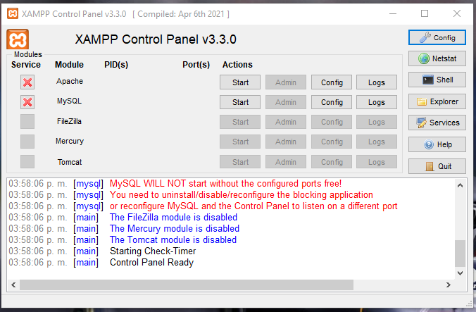
4. Para iniciar Apache y MySQL (los dos componentes principales para ejecutar aplicaciones web), simplemente haz clic en los botones "Iniciar" (junto a sus nombres. Deberían cambiar de color y mostrar "Ejecutándose" cuando estén activos.
    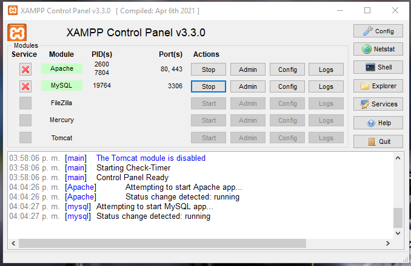

## Paso 2: Verificar que los Servidores Están Funcionando
Una vez que Apache y MySQL estén en ejecución, puedes verificar si están funcionando correctamente. Abre tu navegador web y visita `http://localhost` o `http://127.0.0.1`. Deberías ver la página de inicio de XAMPP, lo que indica que Apache está funcionando.
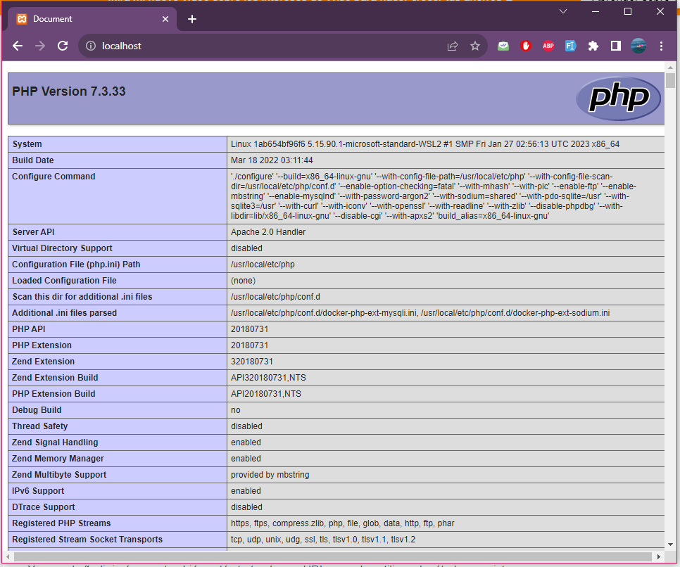

Para verificar MySQL, puedes acceder a la página de inicio de phpMyAdmin visitando `http://localhost/phpmyadmin`. Si puedes iniciar sesión en phpMyAdmin, eso significa que MySQL está funcionando correctamente.


****
#SQLyog

## Paso 1: Abrir SQLyog

Abre SQLyog en tu computadora. Asegúrate de que esté conectado a un servidor de base de datos MySQL antes de continuar.
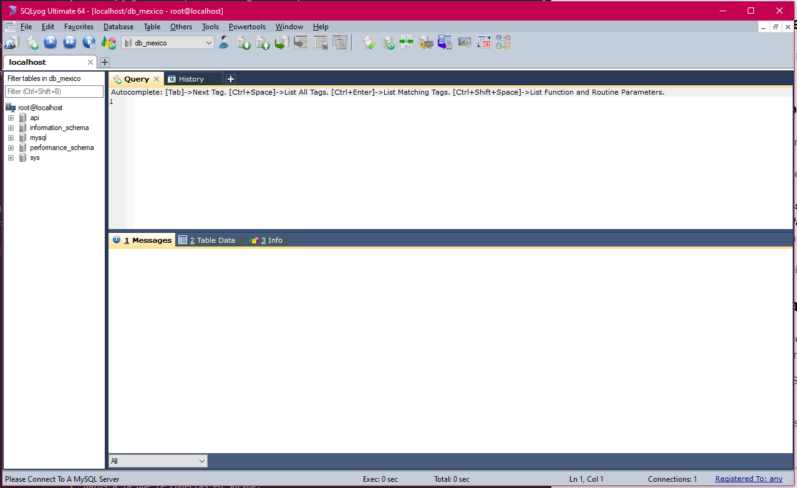

## Paso 2: Conectar a la Base de Datos

Si no estás conectado a la base de datos a la que deseas importar el archivo SQL, realiza la conexión utilizando las credenciales adecuadas.

## Paso 3: Importar el Archivo SQL

1. En el menú superior, selecciona "Tools" (herramientas) y luego elige "Execute SQL Script" (Ejecutar script SQL).
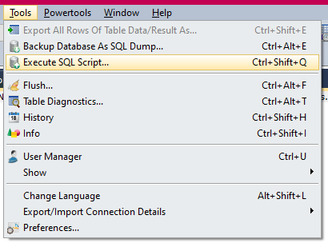
2. Se abrirá una ventana de diálogo. Haz clic en el botón "..." para buscar y seleccionar el archivo SQL que deseas importar.
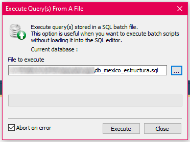
  2.1. Ejecutar el archivo ***db_mexico_estructura.sql***
  2.2. Ejecutar el archivo ***db_mexico_datos.sql***

1. Asegúrate de que las opciones de importación estén configuradas correctamente. Puedes especificar el carácter de terminación de línea y otras configuraciones según tus necesidades.

2. Haz clic en el botón "Execute" (Ejecutar) para iniciar la importación del archivo SQL.
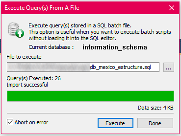

## Paso 4: Revisar los Resultados

SQLyog ejecutará el archivo SQL y mostrará una ventana de importación exitosa o de error. Asegúrate de revisar los resultados para verificar que la importación se haya realizado correctamente.
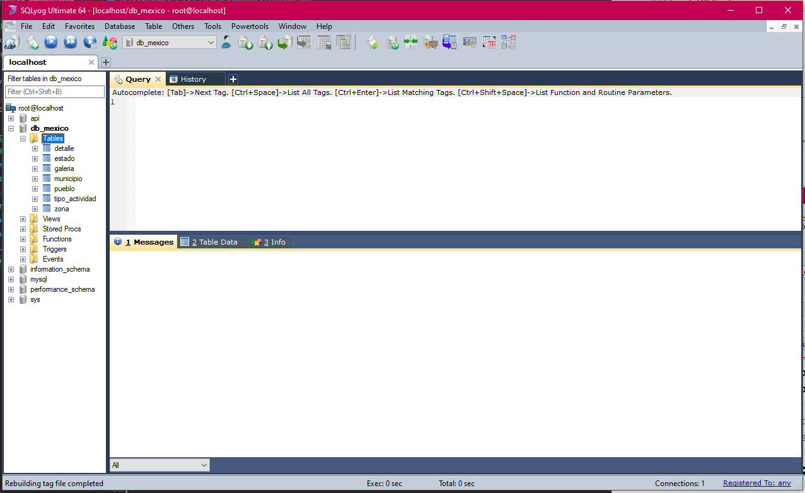

¡Eso es todo! Has importado con éxito un archivo SQL en SQLyog y ejecutado las consultas en tu base de datos.

Recuerda que debes tener los permisos adecuados para realizar estas operaciones en la base de datos a la que te conectas en SQLyog.


****
# Configurar la Conexión a Base de Datos
## Paso 1: Preparación
Antes de comenzar, asegúrate de tener lo siguiente:
- Un servidor web local o en línea que admita PHP y MySQL.
- Las credenciales (nombre de usuario y contraseña) de tu base de datos MySQL.
- El nombre de la base de datos a la que deseas conectarte (**db_mexico**).

## Paso 2: Configurar nuestra clase de Conexión

1. Ubicar la carpera *config*
2. Abrir el archivo `Database.php`
3. Ingresar nuestros datos para la conexión (servidor, usuario, contraseña, base de datos).

```php
<?php
class Database{
    private $host  = '';
    private $user  = '';
    private $password   = "";
    private $database  = "db_mexico"; 
    
    public function getConnection()
    {		
        $conn = new mysqli($this->host, $this->user, $this->password, $this->database);
        if ($conn->connect_error) {
            die("Error failed to connect to MySQL: ".$conn->connect_error);
        } else {
            return $conn;
        }
    }
}
?>
```

****
# Probar nuestra API

[Postman](https://www.postman.com/) es una herramienta popular para probar y desarrollar APIs. También puedes usar Postman directamente en Visual Studio Code (VSCode) a través de la extensión "Postman". A continuación, se describen los pasos para hacer una solicitud con Postman en VSCode:

## Paso 1: Instalar la Extensión Postman

Si aún no tienes Visual Studio Code instalado, puedes descargarlo desde el [sitio web oficial de VSCode](https://code.visualstudio.com/). Luego, sigue estos pasos para instalar la extensión "Postman":

1. Abre Visual Studio Code.

2. Ve al menú "Extensions" (Extensiones) en la barra lateral izquierda o presiona `Ctrl+Shift+X`.
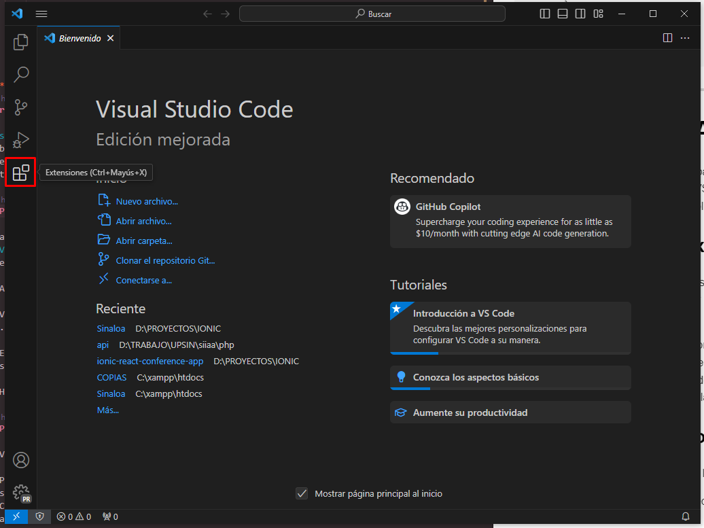

1. En el campo de búsqueda, escribe "Postman" y selecciona la extensión proporcionada por "Postman" y asegurarnos que es del editor verificado.
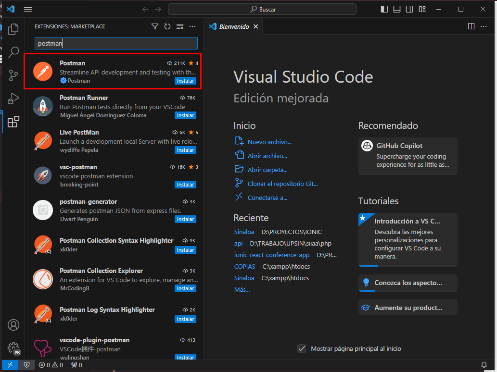

2. Haz clic en el botón "Install" (Instalar) para instalar la extensión.
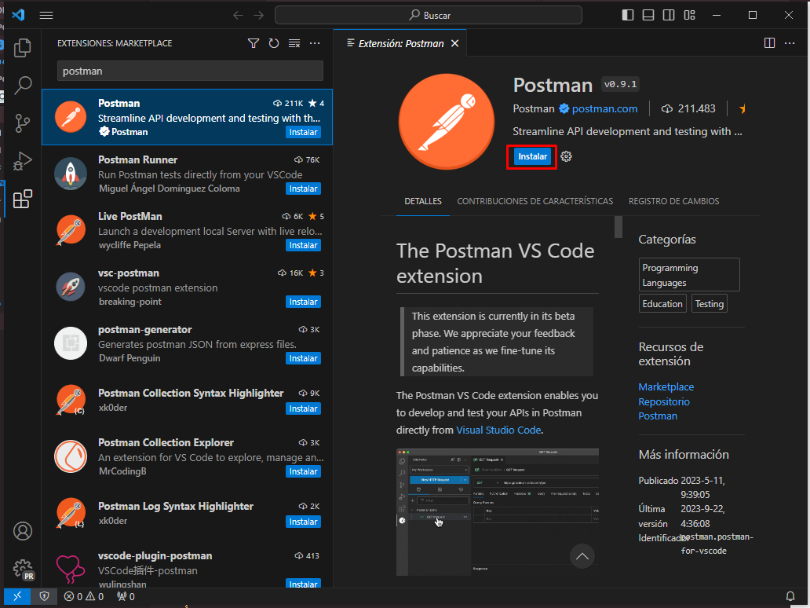

## Paso 2: Crear una Solicitud

En VSCode, ve al menú "Postman" en la barra laterla izquierda. Sigue estos pasos:
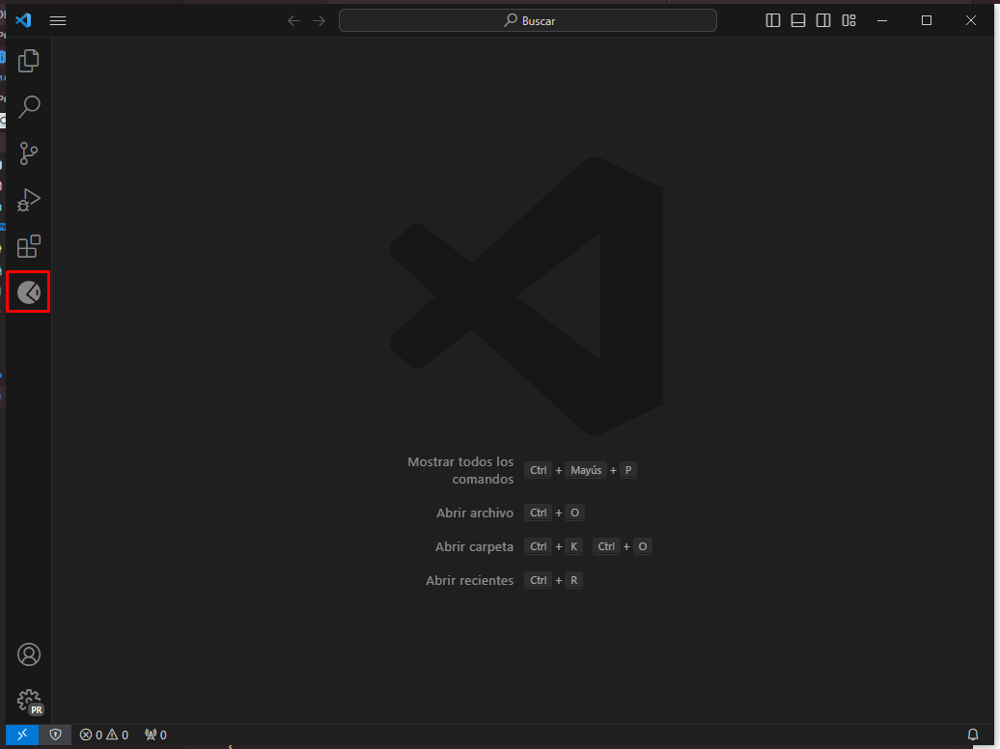

1. Presionar el botón "New HTTP Request", el cual nos abrira una pestaña en la parte de nuestro editor.
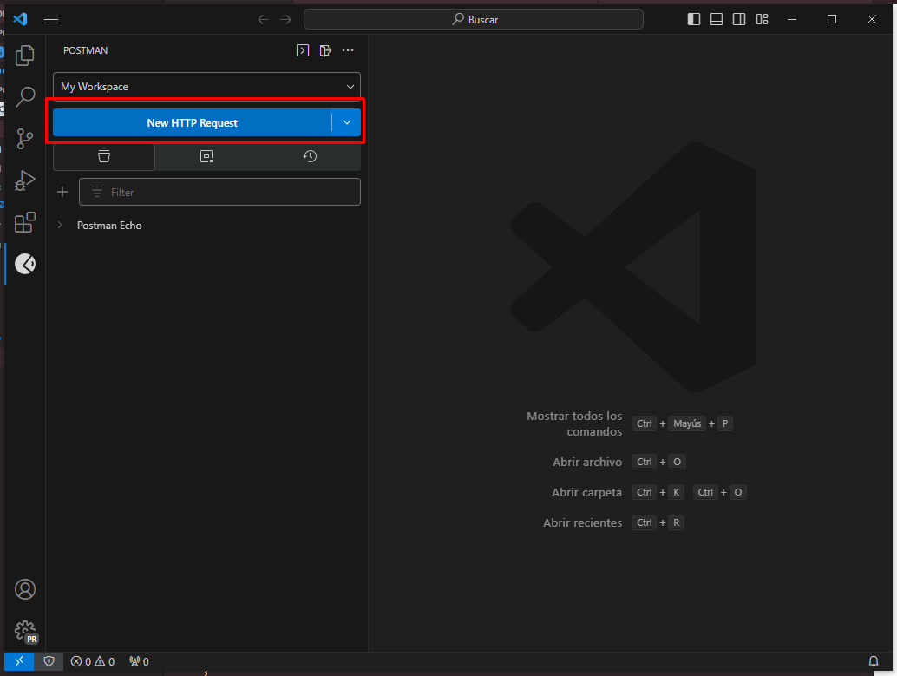
2. Colocamos la siguiente url:
```http
 http://localhost/api/items/read
```
3. agregamos el siguiente parametro:
   -  Key: peticion
   -  Value: municipios
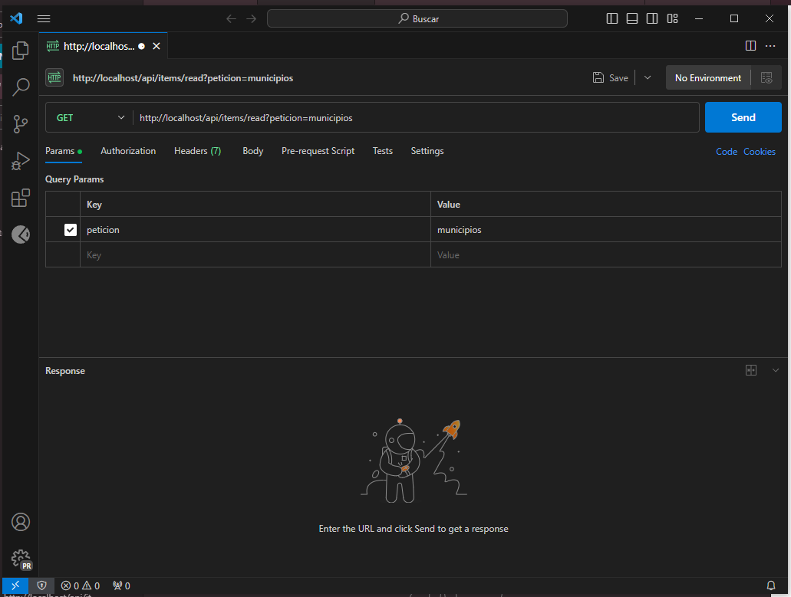
4. Presionamos el botón "Send" y obtendremos la siguiente respuesta:
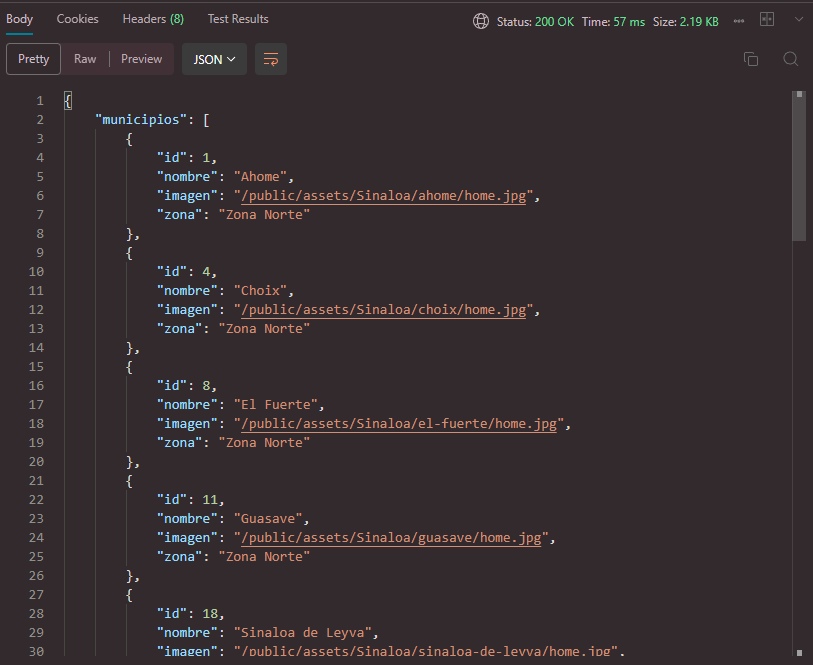
