# Software necesario 
- [Nodejs](https://nodejs.org/dist/v18.18.0/node-v18.18.0-x64.msi)
- [Git](https://git-scm.com/download/win)
- [Xampp](https://sourceforge.net/projects/xampp/files/XAMPP%20Windows/7.4.33/xampp-windows-x64-7.4.33-0-VC15-installer.exe/download)
- [SQLyog](https://www.download.io/sqlyog-community-edition-download-windows.html)
- [VsCode](https://code.visualstudio.com/docs/?dv=win)
  - Extensiones:
    - [Postman](https://marketplace.visualstudio.com/items?itemName=Postman.postman-for-vscode)
    - [Ionic](https://marketplace.visualstudio.com/items?itemName=ionic.ionic)


# Qr


# Cómo Clonar un Repositorio de GitHub

[GitHub](https://github.com/) es una plataforma ampliamente utilizada para el almacenamiento y colaboración de proyectos de desarrollo de software. Clonar un repositorio de GitHub te permite obtener una copia local del código fuente de un proyecto para que puedas trabajar en él en tu propio entorno. A continuación, se describen los pasos para clonar un repositorio de GitHub:

## Paso 1: Iniciar Sesión en GitHub

Si aún no tienes una cuenta de GitHub, debes registrarte en [GitHub](https://github.com/join) para poder clonar repositorios y colaborar en proyectos.

## Paso 2: Encuentra el Repositorio

1. Inicia sesión en tu cuenta de GitHub.
2. Utiliza la barra de búsqueda en la parte superior de la página para buscar el el usuario `eduanayardo`.
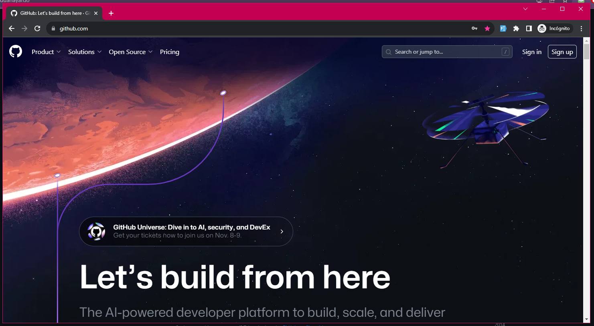 <br>
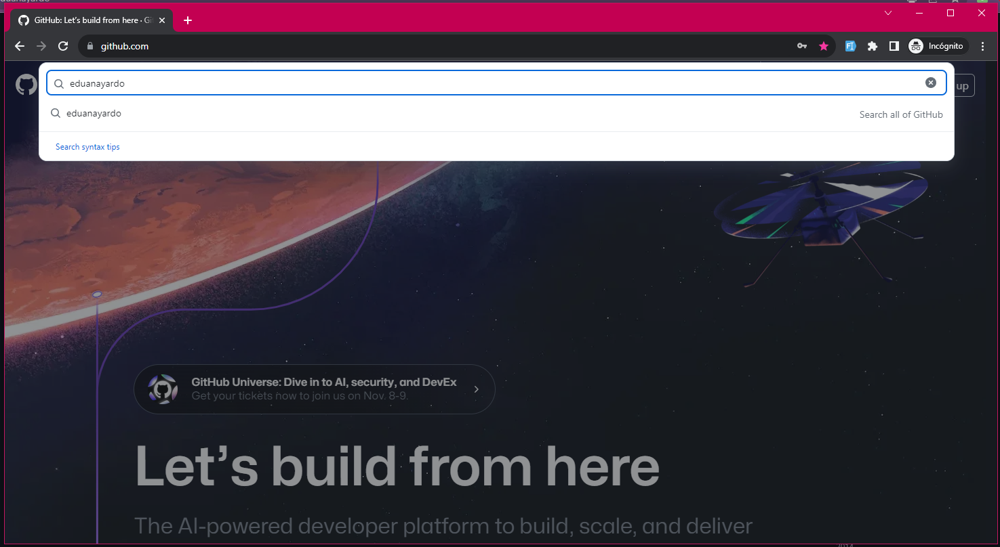 <br>
3. Haz clic en la opción `Users` en el menú izquierdo.
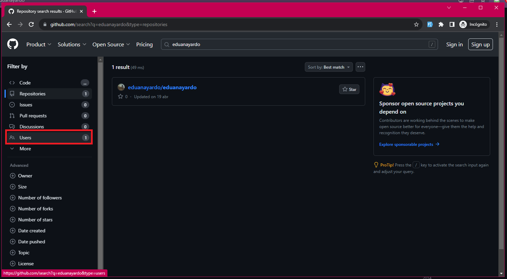 <br>
4. Dar clic en el nombre del usuario.
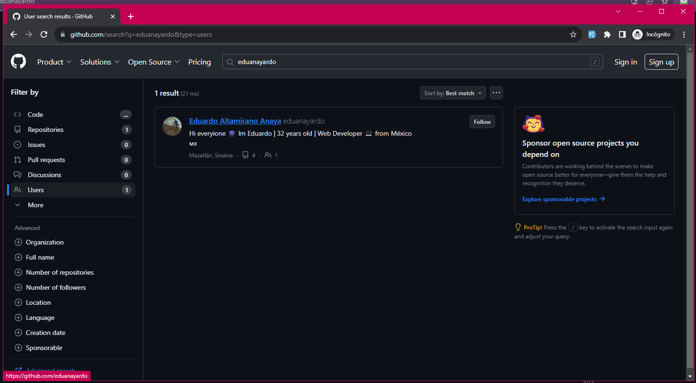 <br>
5. Seleccionar la opción de `Repositories`.
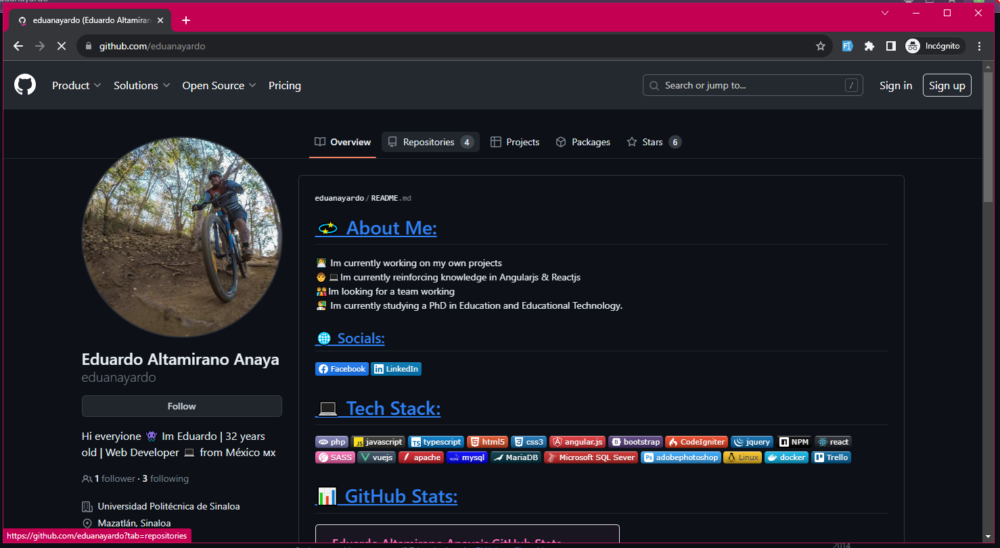 <br>
6. Seleccionar el repositorio a clonar.
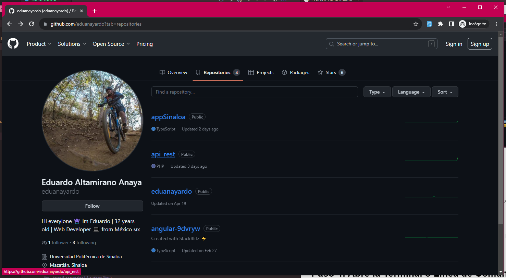 <br>

## Paso 3: Copiar la URL del Repositorio

En la página principal del repositorio, encontrarás el botón "Code" (Código) en la esquina superior derecha. Haz clic en el botón.
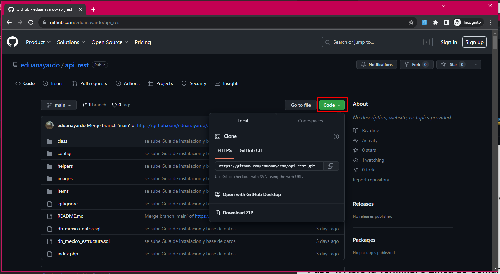 <br>
Y, a continuación, selecciona la URL del repositorio. Puedes copiar esta URL al hacer clic en el icono de copiar que se encuentra junto a ella.
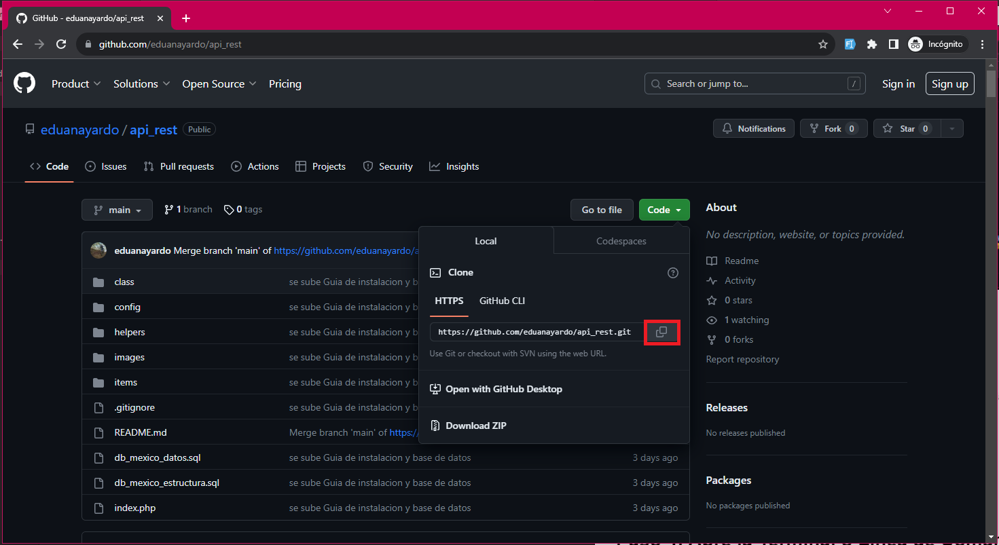 <br>

## Paso 4: Abre la Terminal o Línea de Comandos

Abre la terminal o línea de comandos en tu sistema operativo. Asegúrate de estar ubicado en el directorio donde deseas clonar el repositorio.
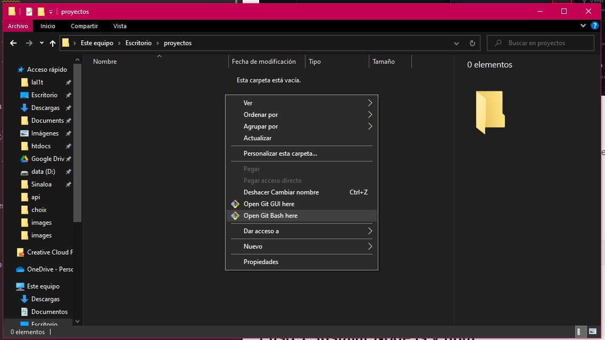 <br>
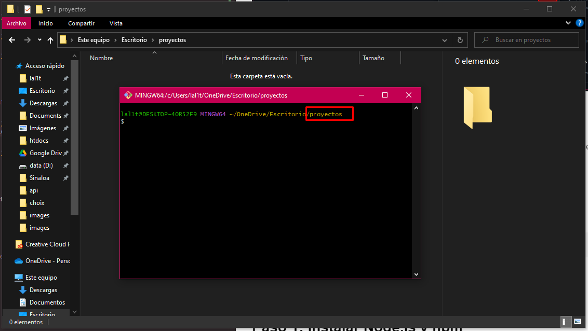 <br>

## Paso 5: Clonar el Repositorio

Utiliza el siguiente comando para clonar el repositorio en tu máquina local:

```bash
git clone https://github.com/eduanayardo/api_rest.git
```
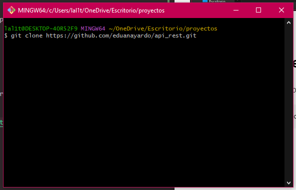 <br>


# XAMPP
## Paso 1: Iniciar XAMPP

1. Abre el menú Inicio o la pantalla de inicio de tu  Windows.
2. Busca "XAMPP Control Panel" o "XAMPP" y ábrelo.
3. Cuando se abra XAMPP Control Panel, verás una ventana con una lista de componentes como Apache, MySQL, PHP, entre otros.
  <br />
4. Para iniciar Apache y MySQL (los dos componentes principales para ejecutar aplicaciones web), simplemente haz clic en los botones "Iniciar" (junto a sus nombres. Deberían cambiar de color y mostrar "Ejecutándose" cuando estén activos.
  <br />

## Paso 2: Verificar que los Servidores Están Funcionando
Una vez que Apache y MySQL estén en ejecución, puedes verificar si están funcionando correctamente. Abre tu navegador web y visita `http://localhost` o `http://127.0.0.1`. Deberías ver la página de inicio de XAMPP, lo que indica que Apache está funcionando.
  <br />

Para verificar MySQL, puedes acceder a la página de inicio de phpMyAdmin visitando `http://localhost/phpmyadmin`. Si puedes iniciar sesión en phpMyAdmin, eso significa que MySQL está funcionando correctamente.


****
# SQLyog

## Paso 1: Abrir SQLyog

Abre SQLyog en tu computadora. Asegúrate de que esté conectado a un servidor de base de datos MySQL antes de continuar.
  <br />

## Paso 2: Conectar a la Base de Datos

Si no estás conectado a la base de datos a la que deseas importar el archivo SQL, realiza la conexión utilizando las credenciales adecuadas.

## Paso 3: Importar el Archivo SQL

1. En el menú superior, selecciona "Tools" (herramientas) y luego elige "Execute SQL Script" (Ejecutar script SQL).
  <br />
2. Se abrirá una ventana de diálogo. Haz clic en el botón "..." para buscar y seleccionar el archivo SQL que deseas importar.
  <br />
    2.1. Ejecutar el archivo ***db_mexico_estructura.sql***
    2.2. Ejecutar el archivo ***db_mexico_datos.sql***
3. Asegúrate de que las opciones de importación estén configuradas correctamente. Puedes especificar el carácter de terminación de línea y otras configuraciones según tus necesidades.
4. Haz clic en el botón "Execute" (Ejecutar) para iniciar la importación del archivo SQL.
  <br />

## Paso 4: Revisar los Resultados

SQLyog ejecutará el archivo SQL y mostrará una ventana de importación exitosa o de error. Asegúrate de revisar los resultados para verificar que la importación se haya realizado correctamente.
<br />

¡Eso es todo! Has importado con éxito un archivo SQL en SQLyog y ejecutado las consultas en tu base de datos.

Recuerda que debes tener los permisos adecuados para realizar estas operaciones en la base de datos a la que te conectas en SQLyog.


****
# Configurar la Conexión a Base de Datos
## Paso 1: Preparación
Antes de comenzar, asegúrate de tener lo siguiente:
- Un servidor web local o en línea que admita PHP y MySQL.
- Las credenciales (nombre de usuario y contraseña) de tu base de datos MySQL.
- El nombre de la base de datos a la que deseas conectarte (**db_mexico**).

## Paso 2: Configurar nuestra clase de Conexión

1. Ubicar la carpera *config*
2. Abrir el archivo `Database.php`
3. Ingresar nuestros datos para la conexión (servidor, usuario, contraseña, base de datos).

```php
<?php
class Database{
    private $host  = '';
    private $user  = '';
    private $password   = "";
    private $database  = "db_mexico"; 
    
    public function getConnection()
    {		
        $conn = new mysqli($this->host, $this->user, $this->password, $this->database);
        if ($conn->connect_error) {
            die("Error failed to connect to MySQL: ".$conn->connect_error);
        } else {
            return $conn;
        }
    }
}
?>
```

****
# Probar nuestra API

[Postman](https://www.postman.com/) es una herramienta popular para probar y desarrollar APIs. También puedes usar Postman directamente en Visual Studio Code (VSCode) a través de la extensión "Postman". A continuación, se describen los pasos para hacer una solicitud con Postman en VSCode:

## Paso 1: Instalar la Extensión Postman

Si aún no tienes Visual Studio Code instalado, puedes descargarlo desde el [sitio web oficial de VSCode](https://code.visualstudio.com/). Luego, sigue estos pasos para instalar la extensión "Postman":

1. Abre Visual Studio Code.
2. Ve al menú "Extensions" (Extensiones) en la barra lateral izquierda o presiona `Ctrl+Shift+X`.
  <br />
3. En el campo de búsqueda, escribe "Postman" y selecciona la extensión proporcionada por "Postman" y asegurarnos que es del editor verificado.
  <br />
4. Haz clic en el botón "Install" (Instalar) para instalar la extensión.
  <br />

## Paso 2: Crear una Solicitud

En VSCode, ve al menú "Postman" en la barra laterla izquierda. Sigue estos pasos:  <br />

1. Presionar el botón "New HTTP Request", el cual nos abrira una pestaña en la parte de nuestro editor.
  <br />
2. Colocamos la siguiente url:
```http
 http://localhost/api_rest/items/read
```
3. agregamos el siguiente parametro:
   - Key: peticion
   - Value: municipios
  <br />
4. Presionamos el botón "Send" y obtendremos la siguiente respuesta:
<br />
